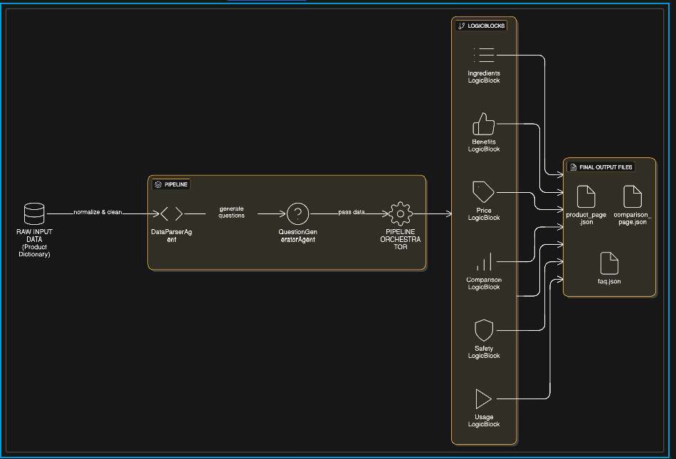

📘 Project Documentation

Project Name: Kasparro Agentic Content Generation System
Repository: kasparro-agentic-himaja-pancharatnam
Author: Himaja Pancharatnam

1. Problem Statement

Kasparro requires a system capable of transforming raw product data into structured, machine-readable content using a scalable and modular agentic architecture. Traditional content pipelines rely on monolithic scripts and hardcoded workflows, making them brittle, difficult to extend, and unsuitable for product-scale automation.

The challenge is to design a system that:

Separates responsibilities using independent agents

Allows reusable content logic

Orchestrates intelligent processing steps

Outputs structured JSON pages automatically

Remains extensible for future product types

The system must accept a minimal dataset and autonomously generate:

A FAQ Page

A Product Description Page

A Comparison Page (with a fictional competitor)

No external research or data is allowed. All output must be derived strictly from input data.

2. Solution Overview

This project implements a modular multi-agent automation system for content generation using a structured pipeline architecture.

At a high level, the system follows this flow:

Product data is passed into a Data Parsing Agent

A Question Generation Agent derives categorized questions

An Orchestrator controls the workflow

Reusable Content Logic Blocks generate semantic sections

A custom Template Engine assembles pages

Final output is written as clean JSON files

Three outputs are generated automatically:

product_page.json

comparison_page.json

faq.json

The architecture emphasizes:

Single Responsibility Agents

Composable Logic Blocks

Deterministic JSON Output

No hidden state or hardcoding

Template-driven content structure

3. Scopes & Assumptions
✅ In Scope

Agent orchestration

Structured content generation

Template engine design

JSON formatting

Modular logic blocks

Internal consistency validation

❌ Out of Scope

UI / Frontend

Database integration

APIs

ML model training

External data enrichment

Cloud deployment

Assumptions

Input data is consistently structured

No missing required fields

All agents operate synchronously

Logic blocks are deterministic

JSON is the only supported output format

4. System Design (MANDATORY)
4.1 Architectural Style

The system follows:

Agent-Orchestrator-Logic (AOL) Architecture

Each layer has a strictly controlled responsibility:

Layer	Responsibility
Agents	Interpret data / generate intelligence
Orchestrator	Control flow & message passing
Logic Blocks	Generate semantic content
Templates	Shape and structure output
Outputs	Persist JSON artifacts
4.2 Core Agents
✅ DataParserAgent

Purpose:

Cleans raw input data

Normalizes keys

Converts input into internal schema

Input:

Raw product dictionary

Output:

Normalized internal product object

✅ QuestionGeneratorAgent

Purpose:

Converts product data into categorized questions

Outputs structured questions for FAQ generation

Categories:

Informational

Usage

Safety

Purchase

4.3 Orchestrator Design

The orchestrator controls the execution lifecycle:

Responsibilities:

Executes agents sequentially

Passes data between components

Collects block outputs

Invokes page generation

Writes JSON files

It functions as a workflow engine and prevents
tight coupling between components.

4.4 Reusable Content Logic Blocks

Each block operates independently on product data.

Logic Block	Responsibility
Benefits	Extract benefits
Usage	Extract usage
Safety	Extract side effects
Price	Extract pricing
Ingredients	Extract ingredient list
Comparison	Compare two products

All blocks:

Accept input data only

Return formatted content

Do not access global state

4.5 Template Engine

Pages are generated using JSON templates designed by the system:

Product Page Template Fields:

name

concentration

skin_type

ingredients

benefits

usage

safety

price

FAQ Template Fields:

category

question

answer

Comparison Template Fields:

product_a

product_b

Templates ensure:

Structured output

Deterministic schema

Frontend compatibility

4.6 Automation Flow
1. Raw Data
2. DataParserAgent
3. QuestionGeneratorAgent
4. Orchestrator
5. Logic Blocks
6. Template Engine
7. JSON Output

The pipeline is deterministic, linear, and idempotent.
This system architectural system design diagram illustrates the flow of product data through a multi-agent system. Raw input is cleaned by the DataParserAgent, transformed into structured questions by the QuestionGeneratorAgent, orchestrated by a central controller, processed by domain-specific logic blocks, and finally exported as structured JSON files for product pages and FAQs.

6. Conclusion

This project successfully demonstrates a production-style agentic architecture for structured content automation. Instead of relying on monolithic scripts or simple prompt chaining, the system explicitly models intelligent behavior through independent agents, orchestration control, and reusable content components.